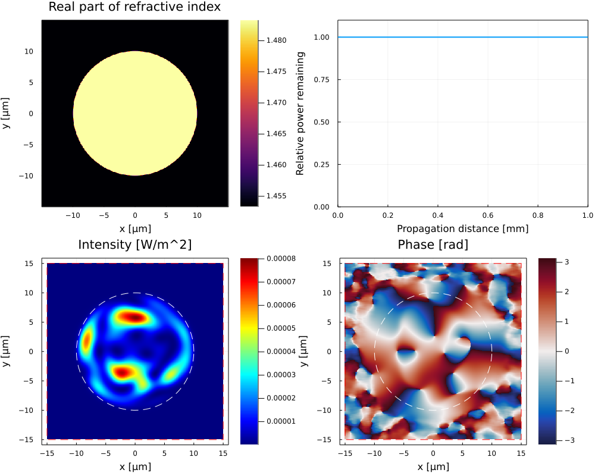

# Simple multimode fiber

This example reproduces figure 1 of the BPM-Matlab [^Veettikazhy2021] paper.

## Description
A Gaussian beam with ``w_0=2.5\mu\, m`` is launched with an offset of 5``\mu``m in the y-direction into the fiber core of a 1 mm long multimode fiber. The beam is titled by 5° towards the positive x-direction by providing a corresponding tilt phase screen for the input electric field. The wavelength is ``800 nm``. The fiber core has a radius of ``10 \mu\, m``, a core refractive index of ``1.4833`` and a cladding refractive index of ``1.4533``. The number of grid points is chosen to result in a resolution of ``\Delta x = \Delta y = 0.067 \mu\, m`` and ``\Delta z=0.4\mu,  m``.

## The code

Run the following code to get figure 1 of the paper. First, the module is loaded. The function `calc_initial_field` is used to calculate the initial gaussian beam. The parameter `X` and `Y` are a grid of points where to calculate the field. `Eparameters` can be used to pass additional parameters to this function.

To prepare for the propagation, a Dict is setup containing all relevant parameters. Finally, the function `fdbpm!` is called with the dictionary as a parameter. This starts the iteration with the given parameters and a plot is generated and updated step by step. The final electric field as well as other parameters a stored within the dictionary and can be used for additional propagation steps or other purposes.

```julia
using BeamPropagationMethod

function calc_initial_field(X, Y, Eparameters)
    w_0 = 2.5e-6
    offset = 5e-6
    amplitude = @. exp(-((X)^2+(Y-offset)^2)/w_0^2)
    phase = @. -sind(5)*X/800e-9*2*π
    E = @. amplitude*exp(im*phase)

    return E
end

p = Dict(    
    :useGPU => false,

    :updates => 50,    

    :Lx_main => 30e-6,
    :Ly_main => 30e-6,
    :Nx_main => 400,
    :Ny_main => 400,
    :padfactor => 1.0,
    :dz_target => 0.4e-6,
    :alpha => 3e14,

    :lambda => 800e-9,
    :n_background => 1.4533,
    :n_0 => 1.4533,
    :Lz => 1e-3,

    :shapes => [0 0 10e-6 2 1.4833],
    :E => calc_initial_field,
    
    :Intensity_colormap => :jet
)

fdbpm!(p);
```

## Expected output

After the full propagation you should see the following plot:



[^Veettikazhy2021]: Madhu Veettikazhy, Anders Kragh Hansen, Dominik Marti, Stefan Mark Jensen, Anja Lykke Borre, Esben Ravn Andresen, Kishan Dholakia, and Peter Eskil Andersen, "BPM-Matlab: an open-source optical propagation simulation tool in MATLAB," Opt. Express 29, 11819-11832 (2021). [Link to article](https://doi.org/10.1364/OE.420493)